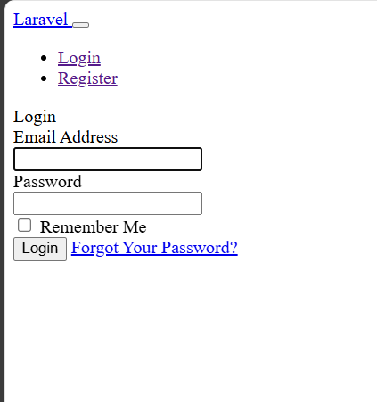

# 📝 Laboratorio #2 – Implementación del Login en Laravel  

## 📌 Introducción  
Este laboratorio tiene como objetivo comprender y documentar la implementación del **login en Laravel**, aplicando el patrón de arquitectura **Modelo-Vista-Controlador (MVC)**. A través de esta práctica, se consolidan los conocimientos sobre controladores, modelos, rutas y vistas, así como el uso de migraciones y configuraciones básicas para el despliegue de un módulo de autenticación.  

Las principales carpetas involucradas en la arquitectura son:  
- **`app/Models`** → Define los modelos que representan las tablas de la base de datos.  
- **`app/Http/Controllers`** → Contiene los controladores que gestionan la lógica del negocio.  
- **`routes/web.php`** → Define las rutas web del proyecto.  
- **`resources/views`** → Contiene las vistas (plantillas Blade) utilizadas en el frontend.  

El objetivo del laboratorio es **configurar y ejecutar un login funcional en Laravel**, documentando el proceso y las dificultades enfrentadas.  

---

## ⚙️ Requisitos Previos  

-   
-   
-   
-   
-   
-   
- Sistema Operativo: **Windows 10**  

---

## 🚀 Flujo de Instalación  

Los comandos utilizados para crear y configurar el proyecto fueron:  

```bash
laravel new nombreDelProyecto
npm install
npm run build
composer run dev
php artisan config:clear
php artisan config:cache
php artisan migrate
composer require laravel/ui
php artisan ui bootstrap
php artisan ua bootstrap -auth
```

---

## 🛠️ Migraciones y Base de Datos  

El entorno del proyecto fue configurado en el archivo **`.env`**, donde se establecieron las credenciales de conexión a la base de datos.  

Para la creación de las tablas se utilizaron los siguientes comandos:  

```bash
php artisan migrate
```

Esto generó las tablas necesarias para el sistema de autenticación (ej. `users`, `password_resets`, `failed_jobs`, etc.).  

📌 Se adjunta un **respaldo de la base de datos** dentro del repositorio.  

---

## 👀 Resultado  

📷   

---

## ⚡ Dificultades y Soluciones  

Durante la ejecución del laboratorio, se presentaron las siguientes dificultades:  

- **Dificultad 1**: Problema con la versión de PHP al crear proyectos.  
  - ✅ Solución: Instalación de PHP 8.4 y edición de las variables de sistema.  

- **Dificultad 2**: Error con **Xdebug** al cambiar de versión de PHP y Laravel.  
  - ✅ Solución: Modificación del archivo `php.ini`, comentando la línea de Xdebug.  

- **Dificultad 3**: Error en **Wamp** al reconocer la versión de PHP (intentaba acceder a la 8.1.31).  
  - ✅ Solución: Descarga y descompresión manual de la versión 8.1.31 dentro del directorio de PHP de Wamp.  

---

## 📚 Referencias  

- [YouTube – Laravel Login Tutorial](https://youtu.be/_Rsen6614Dg?si=wH2f0GiYjLP_NDMW)  
- [YouTube – Laravel Autenticación](https://youtu.be/V34YjN_vQok?si=bExDYV9qH0l0Nkd2)  
- [YouTube – Proyecto Laravel Completo](https://youtu.be/rn2LCOeNPds?si=zuDKYcwdXzZbOjhD)  

---

## 📅 Fecha de Ejecución del Laboratorio  
**28 de septiembre de 2025**  

---

## 👤 Información del Desarrollador  

Este laboratorio ha sido desarrollado por el estudiante de la **Universidad Tecnológica de Panamá**:  

- **Nombre:** Cristopher Núñez  
- **Correo:** cristopher.nunez@utp.ac.pa  
- **Curso:** Ingeniería Web  
- **Instructor del Laboratorio:** Ing. Irina Fong  

---
